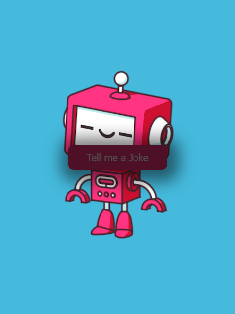
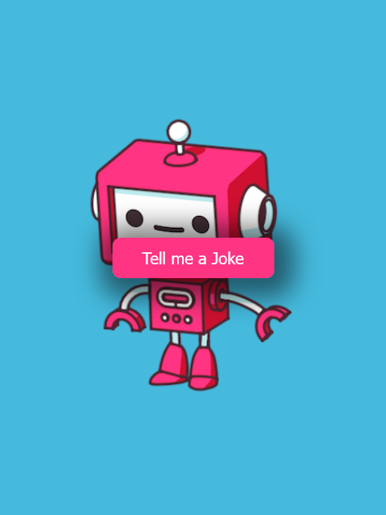

# JOKE TELLER
Tell a joke from the click of a button!

# About
A single web page that tells a joke from the click of a button. Jokes are generated from a Jokes API and are told via a text to speech API

## Table of contents
  - [Screenshot](#screenshot)
- [My process](#my-process)
  - [Built with](#built-with)
  - [Useful resources](#useful-resources)
- [Author](#author)
- [NB](#NB)
- [Acknowledgement](#acknowledgement)

### Screenshot

## My process
- Create an Asynchronous function to retrieve jokes.
- In this function create a variable and store the URL of the Jokes APi in it
- In a 'try' statement, 'fetch' contents from the Jokes API then convert these contents to JSON format using the .json() method. The content returned in json format is the Joke object.
- Use a conditional statement to determine what the joke should be made up of, depending on if it's a single joke or a two part joke.
- Call the function to tell the jokes and call the toggleButton function, still in the 'try' statement.
- Create a function to tell the jokes. This function will take the Joke object variable created in the asynchronous function to retrieve jokes as input. That way the joke object is available to this function.
- The code block of the function contains key parameters required for the text to speech to work as desired. The VoiceRSS variable is created in an SDK file downloaded from the VoiceRSS site. The SDK file contains minified JS code which was used to create the VoiceRSS variable.
- Add an event listener to the button such that when the 'click' event fires, the function to retrieve jokes is called.

### Built with
- HTML5 
- CSS3 custom properties
- Flexbox
- Javascript
- Desktop-first workflow

### Useful resources

- [Jokes API](https://sv443.net/jokeapi/v2/) - This resource creates an API link you can use to generate jokes per the filters you select.

- [text to speech SDK](https://www.voicerss.org/sdk/javascript.aspx) - Download and use the minified code which defines the VoiceRSS variable. The speech property of the Voice RSS code can also be copied from this page and pasted as the code block in the Joke telling function. Here the source can be set to the joke variable and the value of the other parameters can also be tweaked.

- [Voice RSS site](https://www.voicerss.org/) - Create an account and an API key will be assigned to you. Different plans are available.

## Author

- Github - [@Kb-Jr](https://github.com/Kb-Jr)
- Twitter - [@Joker__XL](https://www.twitter.com/Joker__XL)

## NB
- To use this code successfully, An API Key will neeed to be generated and inserted as a string in the script.js file.

## Acknowledgement
-  Jacinto Wong

## Live Link

- [Live Link](https://kb-jr.github.io/JOKE-TELLER/)

